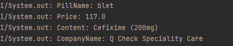
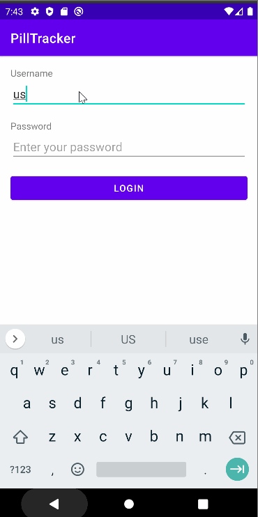
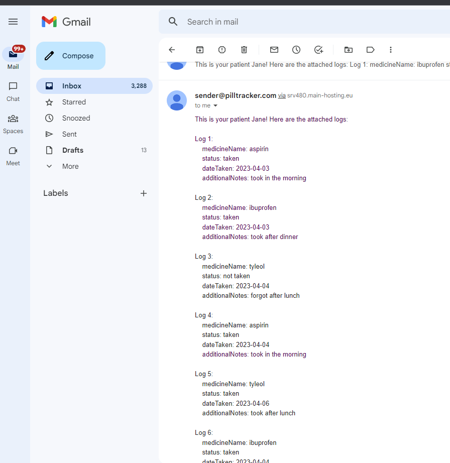

# Android Group Project  - *PillTrackerApp*
# Team 8
# Sprint 1
- [x] Create initial commit for all group members to pull code to their systems for independent work.
- [x] Create login screen
     * Input field for username
     * Input field for password
     * Button to submit credentials
- [x] Backend PHP file for login system
- [x] Setup database
     * Link database to app and test login feature
     
After gaining access to the Google maps API, then implement these features:
- [x] Make successful connection to API.
- [x] Create screen to display map after getting API information.
     * Display user current location and add marker.
- [x] Set up GPS location permission in phone

After finding an API to be used for getting medication details, implement the following features:
- [x] Get response in JSON
- [x] Parse API information
     * Printed/Log Medicine Details after parse
     
 
 
 
 # API parse output
 
 
 # Sprint 2
 
 - [x] Create backend php file for MyPills feature
     * PhP file to retrive  the pill information
- [x] Create backend php file for logs
     * PhP file to insert notes and retrive  the log information
 - [x] basic implemention of mypills page
     * user can access pills details to the database
     * user can see in the recycler view
     
 - [x] basic implementation of logs page
     * user can go to `addnote page` information into database
     * user can see logs info in the recycler view
     
 - [x] Display Nearby Pharmacies on map
     * Get API to pull up nearby pharmacies and display on phone screen.
     * Update map to show markers of nearby pharmacies to current location.
     
 - [x] Parse second endpoint for medicine api    
     * User can search for pills
  
    
  

 
  # Sprint 3
  
  - [x] User can delete items
     * My pills 
     * logs
  - [x] User can swipe to refresh
     * My pills
     * Logs
 - [x] User can select logs and send to doctor's email
 - [x] User can see their profile info
 - [x] Create `Nearby Pharmacy Detail` screen
 - [x] Add marker listener for when user clicks on a nearby pharmacy marker
     * When clicked, open `Nearby Pharmacy Detail` screen and display details according to layout of screen to user
 - [x] Implement zoom in and out buttons for map
 
 
  
  
 #Doctor's email notification
 
 
 
  # Sprint 4
  
- [x] Edit pharmacy fragment screen to be home pharmacy screen
     * Set layout for xml file
- [x] Add search bar to map to search for other pharmacies or locations
     * Place marker at location searched
     * Return details when clicked
- [x] Add button to save pharmacy and update home pharmacy screen with chosen pharmacy
- [x] User can search for medicine
- [x] Auto-complete search
- [x] Add medicines
- [x] Save login credentials using user preferences - which means once the user logs in  for the first time, when the app is closed and reopened, their login credential is saved and automatically opens the application
- [x] Implemented API points for add medication, autocomplete, search medicine, inserting and retrieving place id for google maps add home pharmacy feature
- [x] Added some visual customizations for my pills and log page
  
  
  
  
  
 # License
    Copyright [2023] [Samikshya Poudel, Carlos Espana, Bret Seelall, Temitayo Ilori]

    Licensed under the Apache License, Version 2.0 (the "License");
    you may not use this file except in compliance with the License.
    You may obtain a copy of the License at

        http://www.apache.org/licenses/LICENSE-2.0

    Unless required by applicable law or agreed to in writing, software
    distributed under the License is distributed on an "AS IS" BASIS,
    WITHOUT WARRANTIES OR CONDITIONS OF ANY KIND, either express or implied.
    See the License for the specific language governing permissions and
    limitations under the License.
